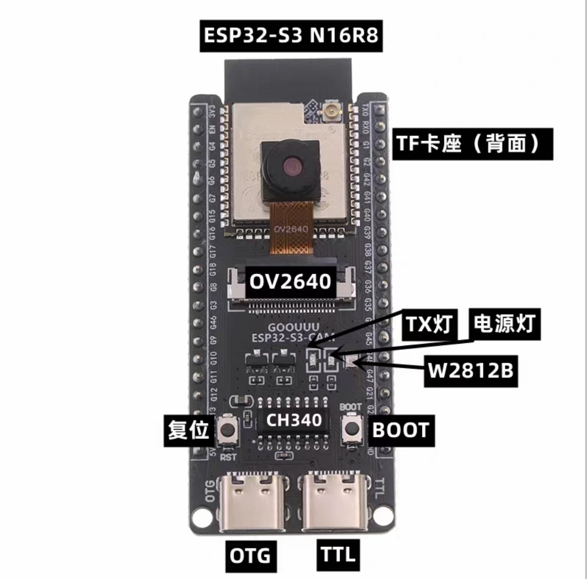

该项目从 [adafruit/Adafruit-ST7735-Library](https://github.com/adafruit/Adafruit-ST7735-Library) fork而来，作为ST7735s显示面板的驱动用在项目中使用。

因为网络上esp32s3与ST7735s的资料较少，故做此纪录。


## 本人的测试环境：

1. esp32s3
2. ST7735s
3. Arduino IDE 3.4.4


## st7735s：GND VCC SCL SDA RST DC CS BLK

1. **VCC**：电源接入，可以是5V或3.3V，为显示屏提供工作电压。
2. **GND**：接地，连接电路的地线。
3. **SCL**：在SPI接口中，SCL通常指的是SPI的时钟线，用于同步数据传输。
4. **SDA**：在SPI接口中，SDA通常指的是SPI的数据线，用于传输数据和命令。
5. **RST**（RESET）：复位信号，用于将显示屏恢复到初始状态，低电平有效。
6. **DC**（Data/Command）：数据/命令选择信号，用于区分发送到SPI总线上的是命令还是数据。当DC为高电平时，表示发送的是数据；当DC为低电平时，表示发送的是命令。
7. **CS**（Chip Select）：片选信号，用于激活显示屏的SPI通信。在SPI通信中，CS引脚需要被拉低以选中设备进行通信。
8. **BLK**：背光控制，可以连接到正电源以控制背光的开关，有时也可以不用连接。

连线（左ST7753s 右esp32s3）：

1. cs ---> G21
2. dc ---> G47
3. sda ---> G41
4. scl ---> G42

其中ST7735s的RST BLK不连，VDD连接3.3V。G21、G47、G41、G42都可以根据自己的连线修改，只需要在初始化Adafruit_ST7735对象的参数中对应即可

```c
//Adafruit_ST7735 tft = Adafruit_ST7735(TFT_CS, TFT_DC, TFT_MOSI, TFT_SCLK, TFT_RST);
Adafruit_ST7735(21, 47, 41, 42, -1); //-1代表RST不连
```


**使用examples时需要将仓库中的头文件和源文件，复制到示例目录中。**


运行 /examples/graphicstest/graphicstest.ino 参考结果MP4：VID20241021130932.mp4